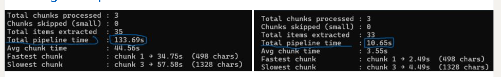

# Granite Sandbox

Small local AI experiments with IBM Granite models through Ollama.

This repo focuses on a simple question:

Can a lightweight local pipeline extract useful information from a PDF without cloud APIs, and how much does runtime improve after a few practical iterations?
## Why this project matters

Many students, researchers, and independent builders do not have access to expensive cloud AI services or high-end hardware.

At the same time, technical documents, research papers, and reports often contain important details that can be missed by simple extraction methods.

This project focuses on understanding how lightweight local AI systems can process these documents more effectively while remaining practical to run on everyday hardware.


## What This Project Does

- reads a PDF resume with `PyPDF2`
- runs local inference with `granite3.3:2b` through Ollama
- extracts technical skills from the document
- tracks how runtime changes across prompt and pipeline changes

## Why I Built It

This is not meant to be a polished product demo.

It is a small student experiment for understanding how local LLM pipelines behave on normal hardware:

- cold start vs warm runs
- heavier prompts vs lean prompts
- simple extraction pipelines vs unnecessary complexity
## Who is this for?
# community

Granite Sandbox explores how local AI systems can improve document understanding on everyday hardware. The project is aimed at students, independent researchers, and anyone working with limited compute resources who may not have access to expensive cloud-based AI services

## Benchmark

Baseline pipeline:

- total pipeline time: `133.69s`

Iterated version:

- total pipeline time: `10.65s`

README image used for the public comparison:



## What Changed Between Runs

- simplified prompting
- reduced overhead in the pipeline
- improved chunk handling in later experiments

## Example Run

```bash
python main.py
```

## Example Output

```text
- Python
- SQL
- PyTorch
- Git
- REST APIs

took 13.96s
```

## Requirements

```text
PyPDF2
ollama
```

## Install

```bash
pip install -r requirements.txt
ollama pull granite3.3:2b
```

## Notes

- the repo is intentionally small
- the goal is experimentation, not fake production scope
- future work is mostly around better benchmarking and broader document tests
#### Future Work

* OCR support
* Layout-aware chunking
* Better handling of research papers
* Reduce memory usage
* Push overall pipeline runtime below 10 seconds
* Test additional local models
* Benchmark across different hardware
* Improve output consistency

